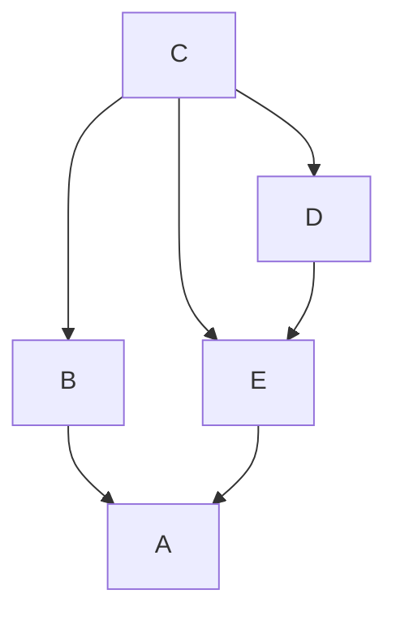

# Cviceni 

1. cviceni

### Mnoziny

- je asymetricka
- neni reflexivni, transitivni

---

| Vlastnost | P | V | B | R | S | Z |
|-----------|---|---|---|---|---|---|
|Symetricka | asym | 1 | 1 | 1 | asym | anti |
| Transitivni | 1 | 1 | 0 | 1 | 1 | 1 |
| Reflexivni | 0 | 1 | 1 | 1 | 0 | 1 | 
| Ekvivalence | 0 | 1 | 0 | 1 | 0 | 0 |

---

Mnozina celych cisel krome 0

- D pokud a deli b beze zbytku
- Z pokud a a b davaji pri deleni cislem 7 stejny zbytek
- S pokud se cisla a a b lisi o nejvyse 10
- R pokud se cisla a a b lisi aspon o 10
- P soucet a a b je sudy
- a i b zaokrouhlime na cele stovky, mezi hodnotami plati a > b

| Vlastnost   | D    | Z | S | R | P | Z |
|-------------|------|---|---|---|---|---|
| Symetricka  | anti | 1 | 1 | 1 | 1 | asym |
| Transitivni | 1    | 1 | 0 | 0 | 1 |  1 |
| Reflexivni  | 1    | 1 | 1 | 0 | 1 | 0 |
| Ekvivalence | 0    | 1 | 0 | 0 | 1 | 0 |

--- 

### Grafy

